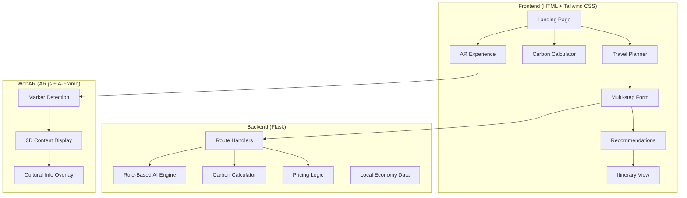
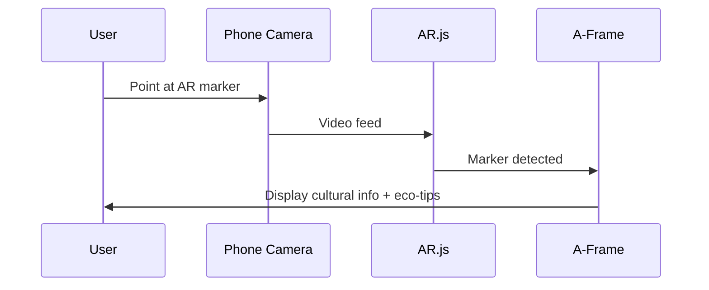

# AI-Powered Sustainable Tourism Platform - Capstone Phase 2
## Implementation Plan

A Flask-based sustainable tourism platform with rule-based AI recommendations, environmental impact assessment, and WebAR cultural engagement features.

> [!IMPORTANT]
> **No datasets or ML training used** - All logic is rule-based with hardcoded knowledge modules.

---

## Project Architecture



---

## Folder Structure

```
Sustainable_Tourism/
├── app.py                      # Main Flask application
├── static/
│   ├── css/
│   │   └── styles.css          # Custom styles + Tailwind overrides
│   ├── js/
│   │   └── main.js             # Form logic, eco-indicators
│   ├── images/
│   │   ├── destinations/       # Destination images
│   │   └── eco-icons/          # Sustainability icons
│   └── ar/
│       ├── markers/            # AR marker patterns
│       └── models/             # 3D models (if any)
├── templates/
│   ├── base.html               # Base template with Tailwind
│   ├── index.html              # Landing page
│   ├── planner.html            # Travel recommendation wizard
│   ├── itinerary.html          # Generated itinerary
│   ├── carbon.html             # Carbon footprint calculator
│   ├── pricing.html            # Dynamic pricing view
│   ├── local.html              # Local economy showcase
│   └── ar.html                 # WebAR experience page
├── modules/
│   ├── __init__.py
│   ├── recommendation_engine.py # Rule-based travel AI
│   ├── carbon_calculator.py     # Eco-footprint logic
│   ├── pricing_engine.py        # Dynamic pricing rules
│   └── knowledge_base.py        # Hardcoded destinations & data
└── docs/
    └── capstone_documentation.md
```

---

## Proposed Changes

### Component 1: Flask Backend Core

#### [NEW] [app.py](file:///c:/Users/DELL/Sustainable_Tourism/app.py)
Main Flask application with routes:
- `/` - Landing page
- `/planner` - Multi-step travel planner (GET/POST)
- `/itinerary` - Display generated itinerary
- `/carbon` - Carbon footprint calculator
- `/pricing` - Dynamic pricing insights
- `/local` - Local economy showcase
- `/ar` - WebAR cultural engagement

---

### Component 2: Rule-Based AI Modules (No ML/Datasets)

#### [NEW] [knowledge_base.py](file:///c:/Users/DELL/Sustainable_Tourism/modules/knowledge_base.py)
Hardcoded knowledge containing:
- 10+ Indian destinations with sustainability scores
- Transport modes with carbon emission factors
- Accommodation types with eco-ratings
- Cultural sites with AR-triggerable information

#### [NEW] [recommendation_engine.py](file:///c:/Users/DELL/Sustainable_Tourism/modules/recommendation_engine.py)
Rule-based recommendation logic:
```python
# Decision matrix based on user inputs
if budget == "low" and preference == "eco-friendly":
    prioritize("homestays", "public_transport")
if duration <= 3:
    filter_destinations(max_distance=500)
```

#### [NEW] [carbon_calculator.py](file:///c:/Users/DELL/Sustainable_Tourism/modules/carbon_calculator.py)
Fixed industry-standard emission factors:
- Flight: 0.255 kg CO2/km
- Train: 0.041 kg CO2/km  
- Bus: 0.089 kg CO2/km
- Car: 0.171 kg CO2/km

#### [NEW] [pricing_engine.py](file:///c:/Users/DELL/Sustainable_Tourism/modules/pricing_engine.py)
Seasonal pricing logic:
- Peak (Oct-Mar): High demand multiplier
- Off-peak (Apr-Sep): Best booking window
- Festival periods: Premium rates

---

### Component 3: Frontend Templates

#### [NEW] [base.html](file:///c:/Users/DELL/Sustainable_Tourism/templates/base.html)
Base template with:
- Tailwind CSS CDN integration
- Navigation with sustainability branding
- Eco-indicator component library

#### [NEW] [index.html](file:///c:/Users/DELL/Sustainable_Tourism/templates/index.html)
Landing page featuring:
- Hero section with sustainability message
- Feature cards for all 5 objectives
- Quick-access to AR experience

#### [NEW] [planner.html](file:///c:/Users/DELL/Sustainable_Tourism/templates/planner.html)
Multi-step travel wizard:
1. Budget selection (eco-nudges)
2. Travel type preference
3. Duration picker
4. Sustainability preference slider

#### [NEW] [itinerary.html](file:///c:/Users/DELL/Sustainable_Tourism/templates/itinerary.html)
Customized itinerary with:
- Eco-score display
- Carbon footprint summary
- Local recommendations

#### [NEW] [carbon.html](file:///c:/Users/DELL/Sustainable_Tourism/templates/carbon.html)
Environmental impact calculator showing:
- Transport emissions comparison
- Accommodation impact
- Food choices impact
- Greener alternatives

#### [NEW] [ar.html](file:///c:/Users/DELL/Sustainable_Tourism/templates/ar.html)
WebAR experience page with:
- AR.js + A-Frame integration
- Marker-based cultural site display
- Sustainability tips overlay

---

### Component 4: WebAR Implementation

#### AR Technology Stack
- **AR.js**: Lightweight, marker-based AR library
- **A-Frame**: Declarative 3D web framework

#### AR Experience Flow


#### AR Markers
Custom markers for:
- Taj Mahal (cultural heritage info)
- Kerala Backwaters (eco-tourism tips)
- Rajasthan Forts (sustainable travel guidance)

---

## UI/UX Design Rationale

### Sustainability-Driven Design Patterns

| Pattern | Implementation | How It Helps Sustainability |
|---------|----------------|----------------------------|
| **Eco-Nudges** | Green badges on sustainable options | Guides users toward eco-choices |
| **Carbon Indicators** | Real-time footprint display | Creates awareness of impact |
| **Progress Visualization** | Eco-score meters | Gamifies sustainable choices |
| **Social Proof** | "87% chose this eco option" | Encourages sustainable behavior |
| **Default Greener** | Pre-select eco-friendly options | Reduces cognitive load |

### User Flow Design

```mermaid
graph LR
    A[Landing] -->|Clear CTA| B[Travel Planner]
    B -->|Step 1| C[Budget with Eco Context]
    C -->|Step 2| D[Travel Type + Impact]
    D -->|Step 3| E[Duration Optimizer]
    E -->|Step 4| F[Sustainability Preference]
    F -->|Generate| G[Personalized Itinerary]
    G -->|Explore| H[AR Experience]
```


---

## Standards Compliance

### ISO 14001 (Environmental Management)
- Carbon footprint calculation methodology
- Continuous improvement through eco-score tracking
- Environmental impact transparency

### UNWTO Guidelines (Sustainable Tourism)
- Local community benefit integration
- Cultural heritage preservation (via AR)
- Economic leakage minimization
- Visitor education on sustainability

### GDPR Considerations
- No personal data storage
- Session-based recommendations only
- Transparent data handling (none stored)

---

## Verification Plan

### Automated Testing
Run Flask application and test routes:
```bash
cd c:\Users\DELL\Sustainable_Tourism
python -m flask run --debug
```

### Browser Testing Checklist
1. **Landing Page**: Verify all navigation links work
2. **Travel Planner**: Test multi-step form flow
3. **Carbon Calculator**: Verify calculations display correctly
4. **AR Page**: Test on mobile device with camera access
5. **Responsive Design**: Test on mobile viewport

### Manual Verification by User
1. Print AR marker and test WebAR camera overlay
2. Verify itinerary recommendations match input parameters
3. Check eco-score calculations are reasonable

---

## Viva Preparation Points

1. **Why rule-based instead of ML?**
   - No training data requirements, instant deployment, transparent logic

2. **How does AR enhance sustainability?**
   - Educates tourists at cultural sites with eco-tips, reduces need for printed materials

3. **ISO 14001 relevance?**
   - Framework for environmental management, carbon tracking aligns with continuous improvement

4. **GDPR compliance approach?**
   - Zero data storage model, session-only processing

5. **Scalability considerations?**
   - Knowledge base can be expanded, modular architecture supports additions
